# Backup Infrastructure & Protection Configuration - Break-Fix Lab

## Lab Overview

This break/fix lab focused on building, validating, intentionally breaking, and troubleshooting an Azure backup environment aligned with AZ-104 administration tasks.

The environment used both a **Recovery Services vault** for Azure VM backup and a **Backup vault** for Azure managed disk protection. Custom backup policies, retention settings, incremental snapshots, managed identities, RBAC permissions, recovery points, and restore workflows were configured and validated before introducing failures.

After establishing a healthy baseline, multiple backup dependencies were intentionally disrupted to reproduce real administrative issues involving protection state, managed identity, RBAC, resource locks, backup schedules, and retention settings. Each failure was investigated using Azure Backup job details, error messages, IAM role assignments, backup-instance status, and recovery-point evidence before applying the minimum required fix and validating recovery.

## Lab Highlights

- Built and validated an Azure backup environment using both a **Recovery Services vault** and a **Backup vault**
- Configured **Enhanced Azure VM backup** with custom scheduling, retention, and Instant Restore settings
- Configured **Azure Disk Backup** using incremental snapshots and a dedicated snapshot resource group
- Implemented **system-assigned managed identity** and least-privilege RBAC with `Disk Backup Reader` and `Disk Snapshot Contributor`
- Validated VM-level and disk-level backup protection through manual backup jobs and recovery points
- Restored a managed disk from a recovery point and reviewed the **OS disk swap** recovery workflow
- Intentionally introduced failures involving backup protection state, managed identity, RBAC, resource locks, schedules, and retention
- Diagnosed failures using Azure Backup job details, error codes, IAM role assignments, backup-instance status, and recovery-point evidence
- Applied minimum-impact fixes and revalidated successful backup operations

## Objectives

- Build a healthy Azure backup environment using a **Recovery Services vault** and a **Backup vault**
- Configure and validate **Azure VM backup** and **Azure managed disk backup**
- Create custom backup policies for scheduling, retention, and Instant Restore
- Configure a dedicated snapshot resource group for Azure Disk Backup recovery points
- Use a **system-assigned managed identity** with least-privilege RBAC permissions
- Validate backup jobs, recovery points, incremental snapshots, and restore operations
- Intentionally break key backup dependencies to reproduce realistic administrative failures
- Troubleshoot issues involving protection state, managed identity, RBAC, resource locks, schedules, and retention
- Apply the minimum required fix for each incident and confirm successful recovery
- 
## Azure Resources and Services Used

- **Azure Virtual Machine** — `vm-backup-01`
- **Recovery Services vault** — `rsv-az104-backup`
- **Backup vault** — `bv-az104-backup`
- **Backup policies** — `vm-daily-lab`, `disk-daily-lab`
- **Managed OS disk** and **incremental snapshots**
- **Snapshot resource group** — `rg-az104-backup-snapshots`
- **System-assigned managed identity**
- **Azure RBAC** — `Disk Backup Reader`, `Disk Snapshot Contributor`
- **Azure Resource Locks**
- **Backup Jobs, Recovery Points, and Managed Disk Restore**

## Healthy Baseline Configuration

Before introducing any failures, the backup environment was built and validated in a healthy state. This established a known-good configuration that could later be used to compare symptoms, identify broken dependencies, and verify recovery after each fix.

### 1. Recovery Services Vault Configuration

A Recovery Services vault named `rsv-az104-backup` was deployed in **East US 2** to provide VM-level backup protection for `vm-backup-01`.

The vault was configured with **locally redundant storage (LRS)** and used as the central recovery service for the virtual machine. This provided the foundation for applying the VM backup policy, generating recovery points, monitoring backup jobs, and performing restore operations.

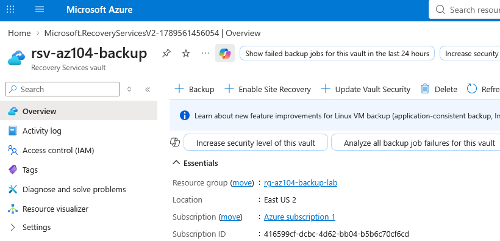

The backup environment was kept inside the dedicated `rg-az104-backup-lab` resource group alongside the virtual machine and supporting backup resources.

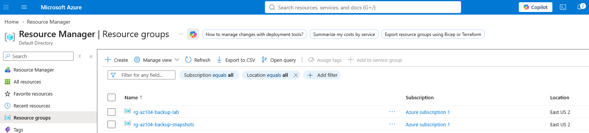

### 2. VM Backup Policy & VM Protection

The Recovery Services vault was configured to protect `vm-backup-01` using the custom Enhanced backup policy `vm-daily-lab`.

The policy defined the VM backup schedule, retention period, and Instant Restore settings. Once assigned, the virtual machine appeared as a protected backup item inside `rsv-az104-backup`, confirming that VM-level protection was successfully configured.

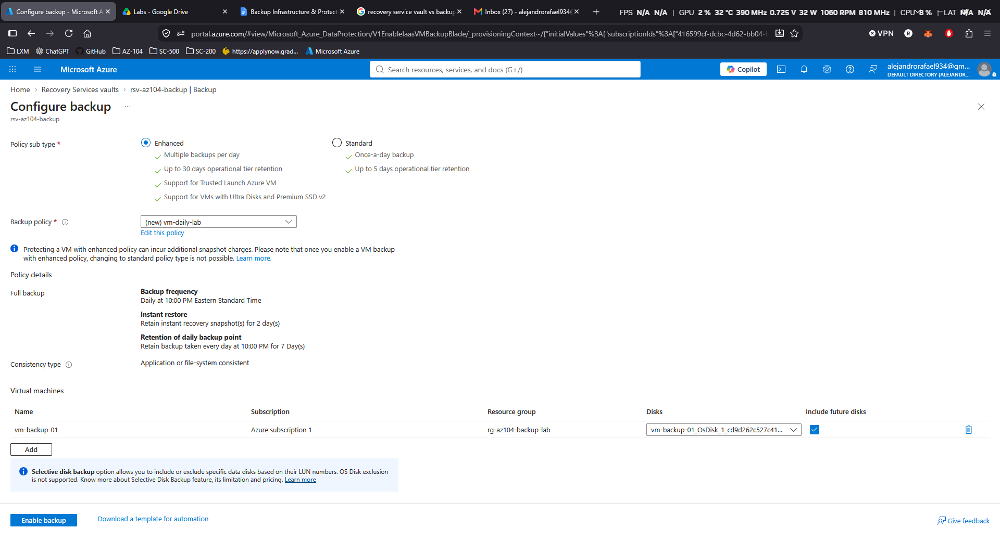

This established the healthy VM backup path:

`vm-backup-01` → `rsv-az104-backup` → `vm-daily-lab` → VM recovery points

### 3. Backup Vault & Azure Disk Backup Configuration

A Backup vault named `bv-az104-backup` was configured to protect the managed OS disk attached to `vm-backup-01`.

The custom disk backup policy `disk-daily-lab` was assigned to the OS disk with a daily backup schedule and **7-day operational retention**. Azure Disk Backup used incremental snapshots to create point-in-time recovery copies without performing a full VM-level backup.

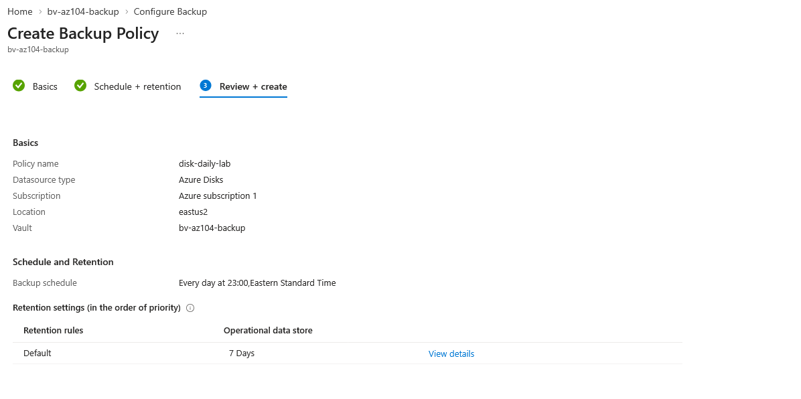

The backup configuration was reviewed to confirm the correct datasource, Backup vault, policy, and snapshot resource group before protection was enabled.

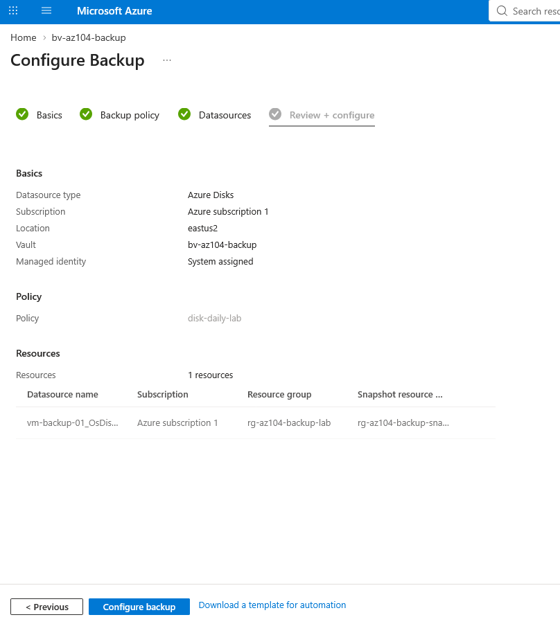

This established the healthy disk backup path:

`OS Managed Disk` → `bv-az104-backup` → `disk-daily-lab` → Incremental recovery points

### 4. Managed Identity & RBAC Configuration

The Backup vault used a **system-assigned managed identity** to access the protected disk and create incremental snapshots.

To follow least-privilege access, the vault identity was granted only the permissions required for Azure Disk Backup:

- `Disk Backup Reader` on the protected OS disk
- `Disk Snapshot Contributor` on `rg-az104-backup-snapshots`

These role assignments allowed the Backup vault to read the source disk and create or manage snapshots in the dedicated snapshot resource group.

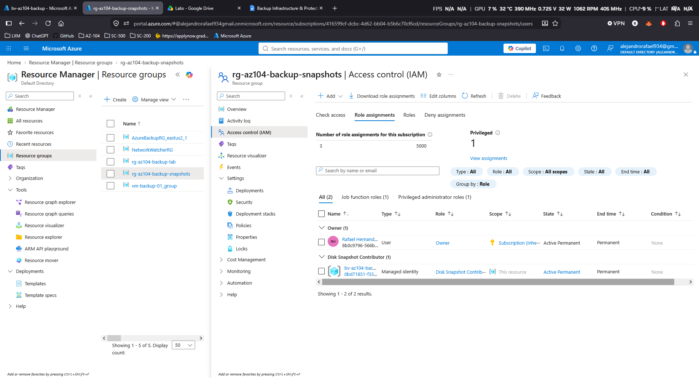

This established the required authorization chain:

`Backup Vault` → `Managed Identity` → `RBAC Role` → `Correct Scope` → Backup operation succeeds

### 5. Incremental Snapshots & Recovery Points

Azure Disk Backup created **incremental snapshots** inside the dedicated resource group `rg-az104-backup-snapshots`.

Each successful backup generated a separate point-in-time snapshot rather than overwriting the previous one. These snapshots formed the operational recovery points used by the Backup vault for disk-level restore operations.

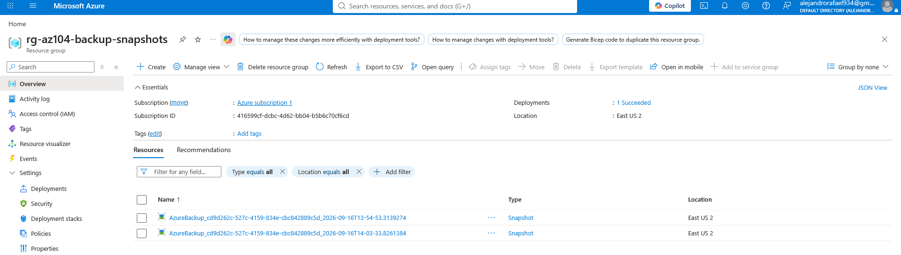

The protected disk also displayed multiple recovery points inside the Backup vault, confirming that the snapshot-based backup process was working correctly.

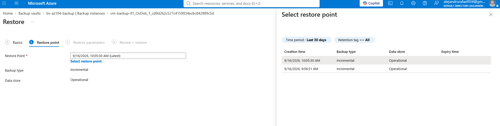

This validated the recovery-point chain:

`Managed Disk` → `Incremental Snapshot` → `Recovery Point` → Point-in-time Restore

### 6. Restore Validation & OS Disk Recovery Workflow

A recovery point from Azure Disk Backup was selected and restored as a **new managed disk** rather than overwriting the original OS disk.

This validated that the protected disk could be recovered independently and that the restored disk could be used for further recovery actions, including attaching it for inspection or replacing the VM's active OS disk.

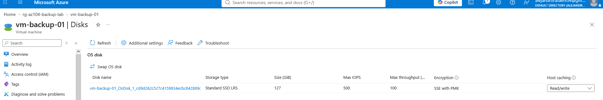

The restore workflow validated the final recovery path:

`Recovery Point` → `Restore` → `New Managed Disk` → `OS Disk Swap or Recovery Use`

## Break/Fix Incidents

After validating the healthy baseline, the environment was intentionally misconfigured to create realistic Azure backup failures.

Each incident was handled using the same troubleshooting process:

`Trigger failure` → `Collect evidence` → `Trace dependency` → `Identify root cause` → `Apply minimum fix` → `Revalidate`

The incidents focused on protection state, managed identity, RBAC scope, resource locks, backup schedules, and retention settings.

### Incident 1 - VM Backup Protection Disabled

The first incident occurred when backup protection for `vm-backup-01` was stopped while existing recovery data was retained.

The VM still had an available recovery point, but the backup item showed:

`Warning (Backup disabled)`

and new backups could not be triggered normally.

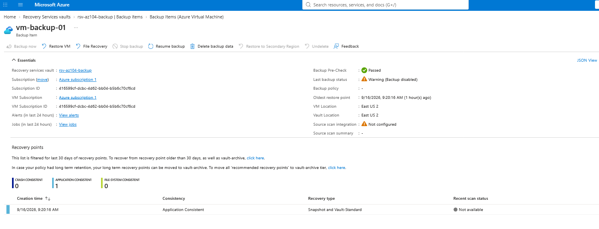

The backup item was inspected and the **Resume backup** option confirmed that protection had been stopped rather than the recovery data being deleted.

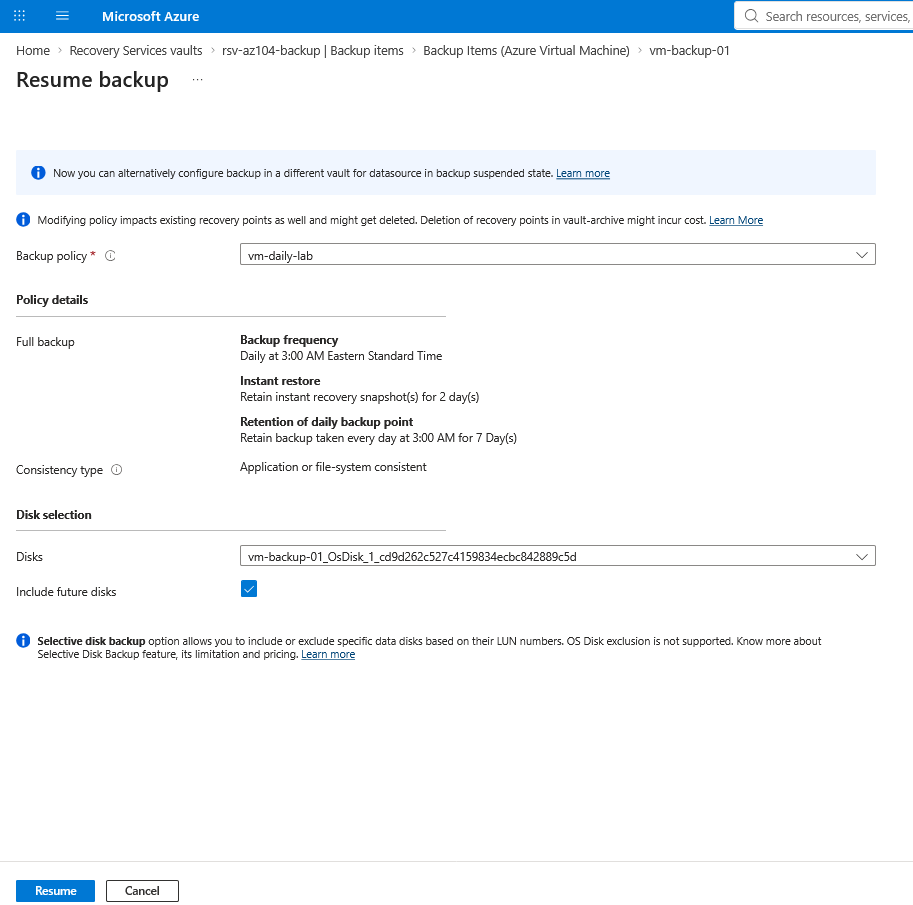

Protection was resumed using the existing `vm-daily-lab` policy. A new manual backup was then triggered to validate the fix.

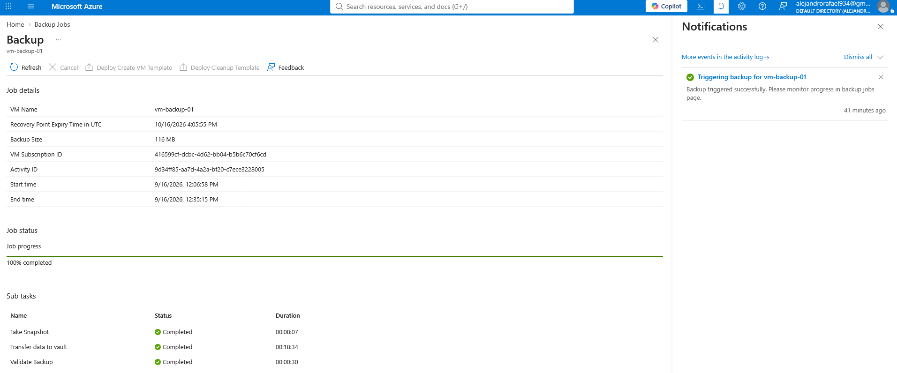

**Root cause:** VM backup protection had been stopped with retained backup data.

**Resolution:** Resume protection and reapply the intended backup policy.

**Validation:** A new VM backup completed successfully.

### Incident 2 - Backup Vault Managed Identity Disabled

The second incident was triggered by disabling the **system-assigned managed identity** on `bv-az104-backup`.

When a new Azure Disk backup was triggered, the job failed with:

`UserErrorSystemIdentityNotEnabledWithVault`

This showed that the Backup vault could no longer authenticate to the Azure resources required for disk backup.

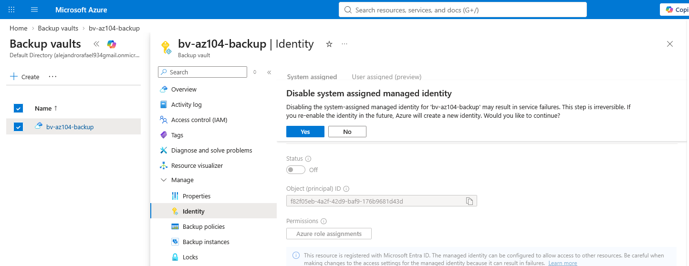

The system-assigned managed identity was re-enabled on the Backup vault. Azure created a new identity for the vault, restoring its ability to authenticate.

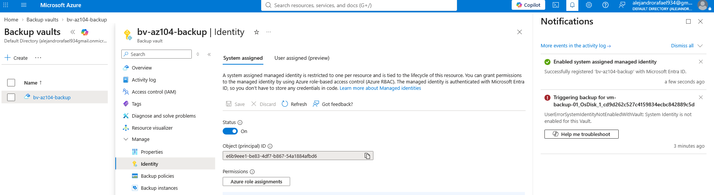

**Root cause:** The Backup vault's system-assigned managed identity had been disabled.

**Resolution:** Re-enable the system-assigned managed identity on `bv-az104-backup`.

**Validation:** The original identity error disappeared and the backup operation progressed to the next dependency check.

### Incident 3 - Missing Disk Backup Reader

After the Backup vault managed identity was re-enabled, a new disk backup was triggered. The job failed with:

`UserErrorDiskBackupDiskOrMSIPermissionsNotPresent`

The error indicated that the Backup vault identity did not have the required permission to read the protected OS disk.

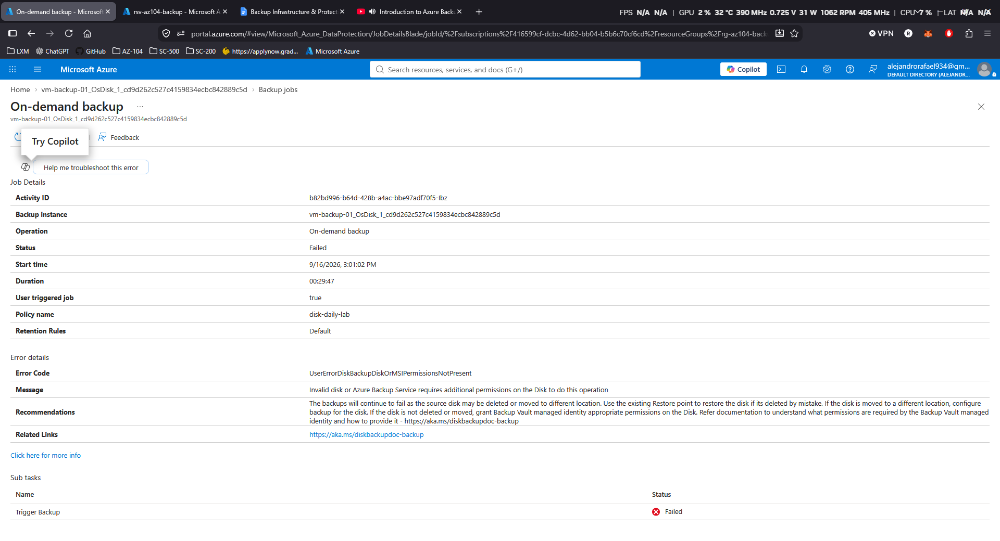

The source managed disk was reviewed under **Access control (IAM)**, where the `Disk Backup Reader` role was missing for the new `bv-az104-backup` managed identity.

The least-privilege role was reassigned directly to the protected disk.

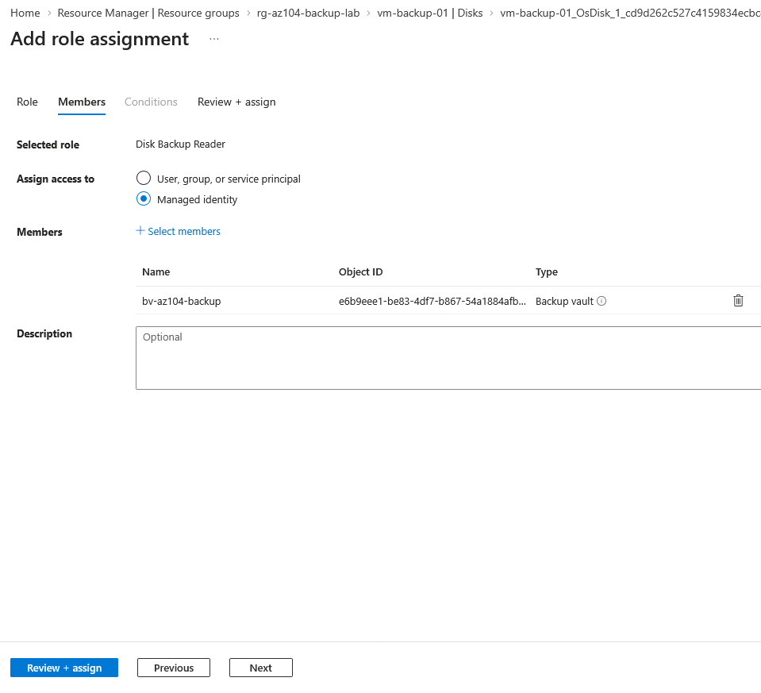

**Root cause:** The Backup vault's new managed identity did not have `Disk Backup Reader` on the source managed disk.

**Resolution:** Assign `Disk Backup Reader` to `bv-az104-backup` at the managed disk scope.

**Validation:** The disk permission error was cleared and the backup progressed to the next dependency check.

### Incident 4 - Missing Disk Snapshot Contributor

After restoring `Disk Backup Reader`, another disk backup was triggered. This time the job failed with:

`UserErrorNotEnoughPermissionOnSnapshotRG`

The error showed that the Backup vault managed identity could read the source disk but did not have permission to create snapshots in `rg-az104-backup-snapshots`.

The required `Disk Snapshot Contributor` role was assigned to the `bv-az104-backup` managed identity at the snapshot resource group scope.

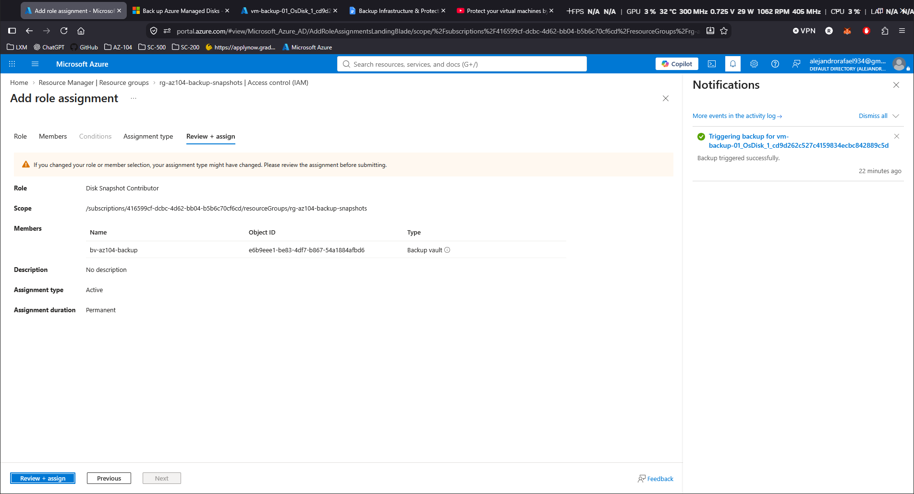

A new backup was then triggered and successfully created another recovery point.

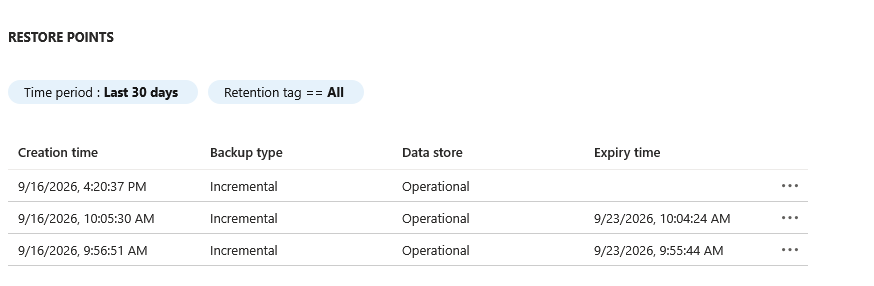

**Root cause:** The Backup vault managed identity was missing `Disk Snapshot Contributor` on the snapshot resource group.

**Resolution:** Assign `Disk Snapshot Contributor` to `bv-az104-backup` at `rg-az104-backup-snapshots`.

**Validation:** A new incremental recovery point was created successfully.

### Incident 5 - Snapshot Deletion Blocked by Resource Lock

The next incident was triggered by attempting to delete one of the Azure Disk Backup snapshots from `rg-az104-backup-snapshots`.

The delete operation failed because the snapshot resource group had a **Delete (CanNotDelete) resource lock** applied.

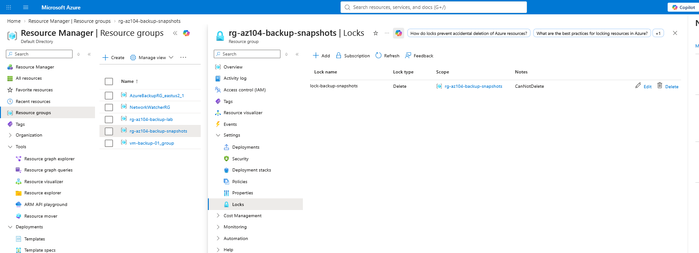

When the snapshot deletion was attempted, Azure returned an error indicating that the resource could not be deleted because the scope was locked.

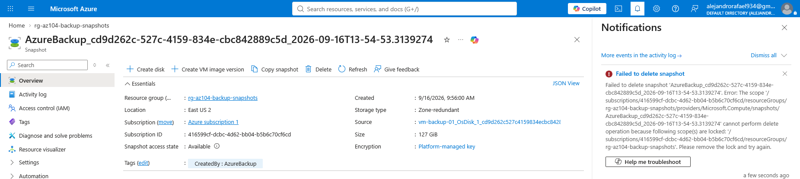

The resource group lock was removed and the delete operation was attempted again successfully.

**Root cause:** A `CanNotDelete` resource lock at the snapshot resource group scope prevented deletion of the snapshot.

**Resolution:** Remove the blocking resource lock from `rg-az104-backup-snapshots`.

**Validation:** The same snapshot could be deleted successfully after the lock was removed.

### Incident 6 - VM Backup Policy Schedule Misconfiguration

The VM backup policy `vm-daily-lab` was intentionally changed from the expected **10:00 PM Eastern** schedule to an incorrect backup time.

Although backup protection remained enabled, the policy no longer matched the required operational schedule.

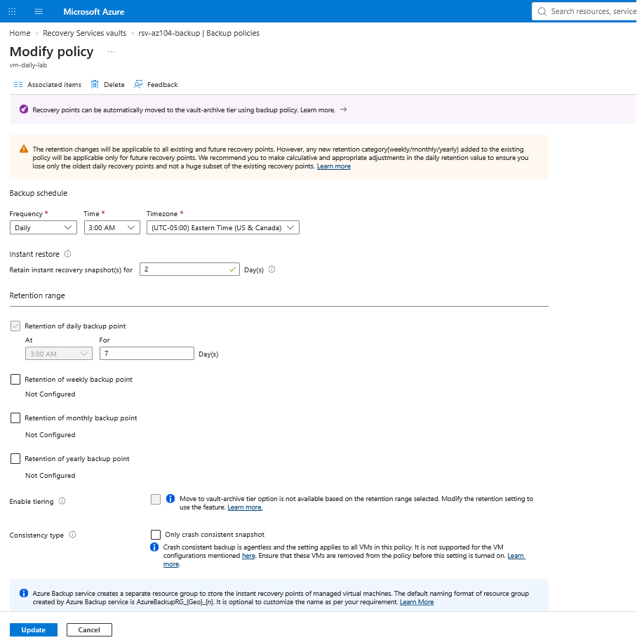

The policy was reviewed and corrected back to the intended daily schedule of **10:00 PM Eastern**.

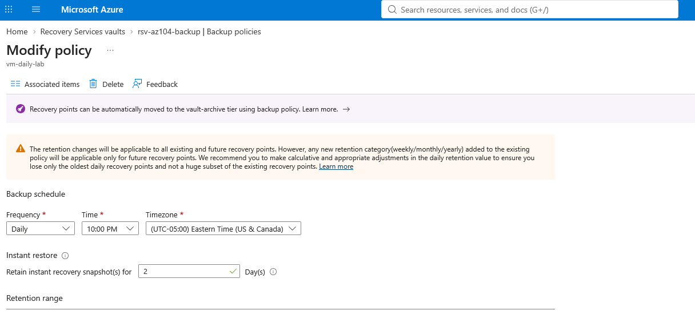

**Root cause:** The VM backup policy schedule had been changed to the wrong backup time.

**Resolution:** Restore the `vm-daily-lab` schedule to **10:00 PM Eastern**.

**Validation:** The policy again matched the intended backup schedule.

### Incident 7 - Disk Backup Retention Misconfiguration

The Azure Disk Backup policy `disk-daily-lab` was intentionally changed from the expected **7-day operational retention** to an incorrect shorter retention period.

The backup process itself remained functional, but recovery points would expire sooner than required, reducing the available recovery window.

The policy was reviewed and corrected back to **7 days**.

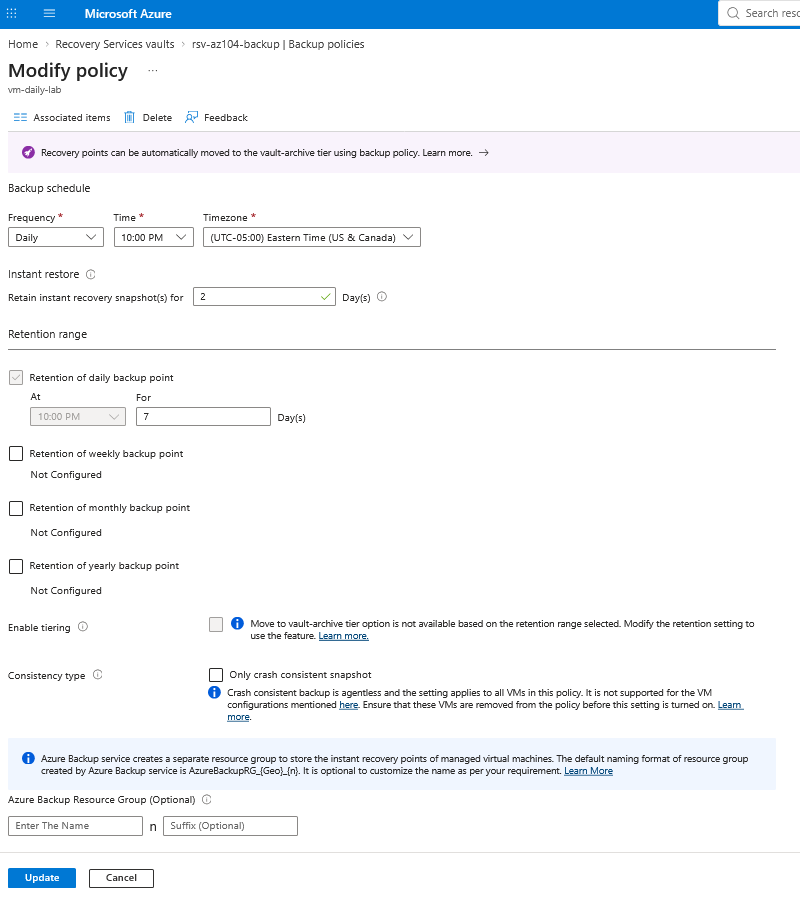

**Root cause:** The Azure Disk Backup policy retention period had been changed from the intended value.

**Resolution:** Restore the `disk-daily-lab` operational retention period to **7 days**.

**Validation:** The policy again matched the required recovery-point retention window.

## Key Dependency Chains

This lab reinforced that Azure Backup troubleshooting depends on understanding how multiple services and permissions connect.

### VM Backup

`Virtual Machine` → `Recovery Services Vault` → `Backup Policy` → `Protection State` → `Recovery Point`

A failure anywhere in this chain can prevent new VM backups even when older recovery points still exist.

### Azure Disk Backup

`Backup Vault` → `System-Assigned Managed Identity` → `RBAC` → `Managed Disk` → `Snapshot Resource Group` → `Incremental Snapshot`

For disk backup to succeed, the Backup vault identity must have:

- `Disk Backup Reader` on the protected managed disk
- `Disk Snapshot Contributor` on the snapshot resource group

### Authorization

`Azure Resource` → `Managed Identity` → `RBAC Role` → `Scope` → `Effective Permission` → `Operation Succeeds or Fails`

This dependency chain was especially important when the Backup vault identity was disabled and recreated, because the new identity required its RBAC assignments to be restored.

### Recovery

`Recovery Point` → `Restore` → `New Managed Disk` → `Attach / Inspect / OS Disk Swap`

Disk recovery creates a new managed disk rather than automatically replacing the original VM disk.

## Key Lessons Learned

- A **Recovery Services vault** protects the VM as a workload, while a **Backup vault** can protect an individual managed disk.
- Azure Disk Backup uses **incremental snapshots** to maintain multiple point-in-time recovery points efficiently.
- A Backup vault relies on its **managed identity** to access protected resources; identity and RBAC are separate dependencies.
- Re-enabling a deleted system-assigned managed identity creates a **new identity**, so previous role assignments may no longer apply.
- Least-privilege RBAC matters: the source disk and snapshot resource group require different roles at different scopes.
- Existing recovery points can remain available even when new backup protection is disabled.
- Resource locks can block backup-related administrative operations even when RBAC permissions are correct.
- Backup schedules and retention settings can be misconfigured without producing an immediate failed job, making configuration validation just as important as error troubleshooting.
- Successful troubleshooting works best by following the dependency chain from the failed operation instead of changing multiple settings at once.
- A backup should not be considered fully validated until both **backup creation and restore capability** have been tested.
